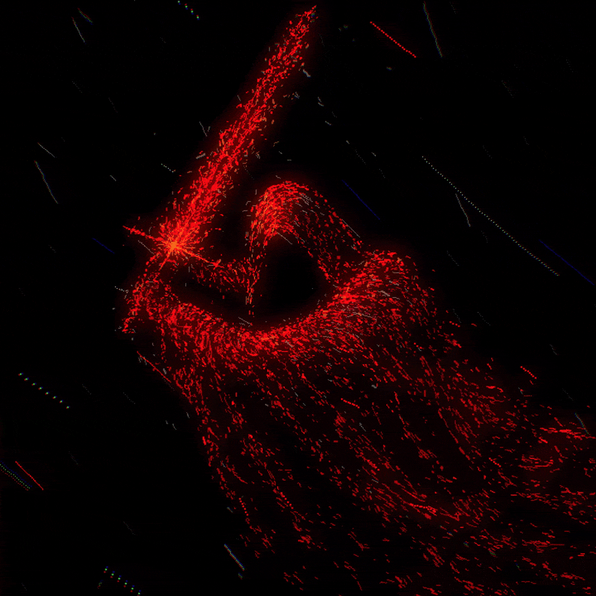

<table>
  <tr>
    <td valign="top" width="0%" align="center">
      
    </td>
    <td valign="top" width="0%" style="padding-left: 20px;">
      
## Hi 👋
      
Hello there, welcome to my GitHub.
You don't have to be extraordinary to start
but you have to start to become extraordinary.

### Connect with me

---

